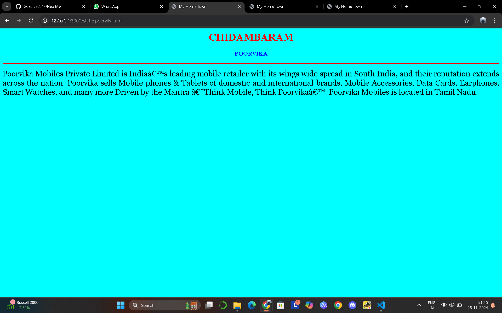

# Ex04 Places Around Me
## Date:27:11:2024

## AIM
To develop a website to display details about the places around my house.

## DESIGN STEPS

### STEP 1
Create a Django admin interface.

### STEP 2
Download your city map from Google.

### STEP 3
Using ```<map>``` tag name the map.

### STEP 4
Create clickable regions in the image using ```<area>``` tag.

### STEP 5
Write HTML programs for all the regions identified.

### STEP 6
Execute the programs and publish them.

## CODE
```
map.html
<html>
<head>
<title>My City</title>
</head>
<body>
<h1 align="center">
<font color="red"><b>Chidhambaram</b></font>
</h1>
<h3 align="center">
<font color="blue"><b>Gokul V E (24002047)</b></font>
</h3>
<center>

<map name="MyCity">
<area target="" alt="temple" title="temple" href="temple.html" coords="563,531,759,606" shape="rect">
<area target="" alt="railway" title="railway" href="railway.html" coords="1047,687,52" shape="circle">
<area target="" alt="garden" title="garden" href="garden.html" coords="923,740,1099,803" shape="rect">
<area target="" alt="bank" title="bank" href="bank.html" coords="972,542,49" shape="circle">
<area target="" alt="poorvika" title="poorvika" href="poorvika.html" coords="765,466,903,545" shape="rect">
</map>
</map>
</center>
</body>
</html>

bank.html

<html>
<head>
<title>My Home Town</title>
</head>
<body bgcolor="YELLOW">
<h1 align="center">
<font color="GREEN"><b>CHIDAMBARAM</b></font>
</h1>
<h3 align="center">
<font color="WHITE"><b>BANK</b></font>
</h3>
<hr size="3" color="black">
<p align="justify">
<font face="Georgia" size="5">
    Axis Bank is the third largest private sector bank in India.
     The Bank offers the entire spectrum of financial services to customer segments covering Large and Mid-Corporates, MSME, Agriculture and Retail Businesses.
</font>
</p>
</body>
</html>

garden.html

<html>
<head>
<title>My Home Town</title>
</head>
<body bgcolor="YELLOW">
<h1 align="center">
<font color="GREEN"><b>CHIDAMBARAM</b></font>
</h1>
<h3 align="center">
<font color="WHITE"><b>BANK</b></font>
</h3>
<hr size="3" color="black">
<p align="justify">
<font face="Georgia" size="5">
    Axis Bank is the third largest private sector bank in India.
     The Bank offers the entire spectrum of financial services to customer segments covering Large and Mid-Corporates, MSME, Agriculture and Retail Businesses.
</font>
</p>
</body>
</html>

poorvika.html

<html>
<head>
<title>My Home Town</title>
</head>
<body bgcolor="cyan">
<h1 align="center">
<font color="red"><b>CHIDAMBARAM</b></font>
</h1>
<h3 align="center">
<font color="blue"><b>POORVIKA</b></font>
</h3>
<hr size="3" color="red">
<p align="justify">
<font face="Georgia" size="5">
    Poorvika Mobiles Private Limited is India’s leading mobile retailer with its wings wide spread in South India,
     and their reputation extends across the nation. Poorvika sells Mobile phones & Tablets of domestic and international 
     brands, Mobile Accessories, Data Cards, Earphones, Smart Watches, and many more Driven by the Mantra ‘Think Mobile,
      Think Poorvika’. Poorvika Mobiles is located in Tamil Nadu.  
   
</font>
</p>
</body>
</html>

railway.html

<html>
<head>
<title>My Home Town</title>
</head>
<body bgcolor="BLUE">
<h1 align="center">
<font color="BLACK"><b>CHIDAMBARAM</b></font>
</h1>
<h3 align="center">
<font color="GREY"><b>RAILWAY</b></font>
</h3>
<hr size="3" color="black">
<p align="justify">
<font face="Georgia" size="5">
    Chidambaram railway station (station code: CDM) is an NSG–5 category Indian railway station in Tiruchirappalli railway division of Southern Railway zone.[2] It is a railway station situated in Chidambaram,
     a municipal town and a taluk headquarters in Cuddalore district, Tamil Nadu, India. It is situated on the main line.
</font>
</p>
</body>
</html>

temple.html


<html>
<head>
<title>My Home Town</title>
</head>
<body bgcolor="PINK">
<h1 align="center">
<font color="BLACK"><b>CHIDAMBARAM</b></font>
</h1>
<h3 align="center">
<font color="RED"><b>TEMPLE</b></font>
</h3>
<hr size="3" color="black">
<p align="justify">
<font face="Georgia" size="5">
    Chidambaram railway station (station code: CDM) is an NSG–5 category Indian railway station in Tiruchirappalli railway 
    division of Southern Railway zone.[2] It is a railway station situated in Chidambaram, 
    a municipal town and a taluk headquarters in Cuddalore district, Tamil Nadu, India. It is situated on the main line.
</font>
</p>
</body>
</html>

```

## OUTPUT



## RESULT
The program for implementing image maps using HTML is executed successfully.
